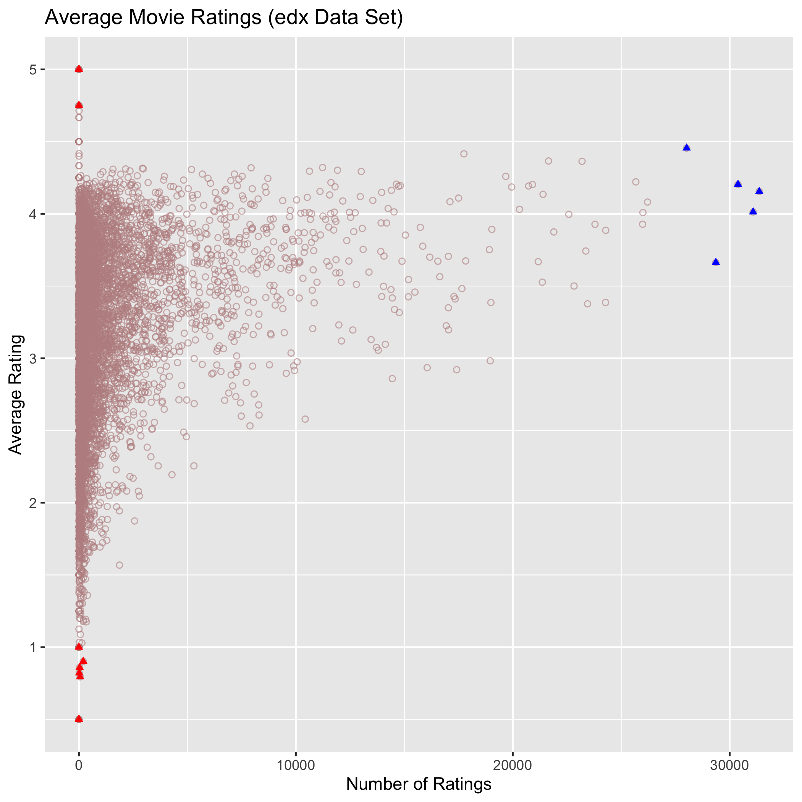
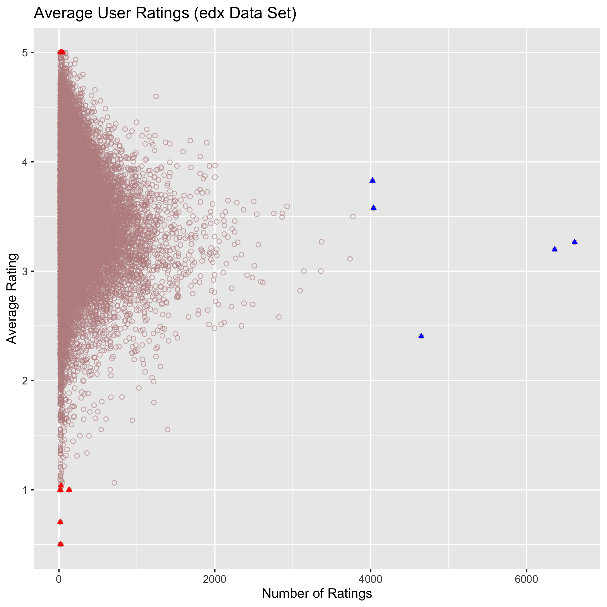

```{r setup, include=FALSE}
library(tidyverse)
library(knitr)
library(grid)
library(gridExtra)
knitr::opts_chunk$set(echo = FALSE)
load("./rdas/data_summary.rda")
load("./rdas/movie_data_analysis.rda")
load("./rdas/user_data_analysis.rda")
load("./rdas/edx_data_summary.rda")
load("./rdas/results.rda")
```

# Introduction

The purpose of this project is to provide a machine learning model for a movie recommendation system.  The data on which this model is produced is the Movielens 10M dataset available from [GroupLens research lab](https://grouplens.org/datasets/movielens/10m/)

The Movielens 10M dataset comprises around 10 million ratings categorised by user, movie and one or more genres. Approximately 10% of the data is reserved as a validation set, with the remainder being used to train and test the modelling of the recommendation system. Despite being a partitition of the full datset, the validation set will be treated as "unseen" as far as developing the recommendation model is concerned. It will only be used at the end of the process to validate the accuracy of the model. The allocation of the Movielens 10M dataset to training/testing and to validation is shown in Table 1.

```{r data_summary, echo = FALSE}
t1 <- data_summary
kable(t1, caption = "Summary of Movielens 10M Data",
      col.names = c("Dataset", "No of Rows", "No of Movies", 
                    "No of Users"))
```

The metric for measuring the accuracy of the model produced is the root mean square error ($\textbf {RMSE}$) represented by the equation

> $\textbf {RMSE} = \sqrt{(\frac {1}{N})\sum_{u,i}(\hat y_{u,i}-y_{u,i})^2}$

where $y_{u,i}$ is the rating for movie i by user u, $\hat y_{u,i}$ is the corresponding prediction produced by the model, and $N$ is is the number of user/movie combinations in the dataset.

The report begins with some analysis of the dataset in order to look for patterns and correlations within the data. The analysis (on the whole of the Training/Testing dataset (**edx**) informs the choices of methods used for modelling the predictions. The investigation looks at movie and user biases (or effects).  These are split into two types, namely per-movie and per-user average biases, and then time-dependent movie and user biases.

Next, the details of how each bias is modelled is set out and the recommendation system model is built. The **edx** dataset is first split 90/10 into training and testing datasets **edx_train** and **edx_test** as set out in Table 2.

```{r edx_data_summary, echo = FALSE}
t2 <- edx_data_summary
kable(t2, caption = "Summary of **edx** Training and Test Datasets",
      col.names = c("Dataset", "No of Rows", "No of Movies", 
                    "No of Users"))
```

A linear model is used for developing the recommendation system. Each bias modelled is added to the average rating over all movies and all users. Our estimate for the average rating (denoted $\hat \mu$) is the average over all the ratings in the **edx** dataset. The predicted rating for a given row in a dataset will then be $\hat \mu$ plus the sum of the biases for the parameters in that row of the dataset.

These predictions are derived from the data in the **edx_train** dataset and tested on the **edx_test** dataset.

Finally the recommendations system model is used to derive predicted ratings on the validation dataset and report the results of the $\textbf {RMSE}$ calculation.

\newpage

# Data Analysis

## Average Per-Movie Ratings

Intuitively, some movies are better than others, so it is to be expected that there is a spread of ratings between movies. By the same token, "blockbuster" movies are likely to be rated more often than say "art house" movies.  

Tables 3 and 4 below show the best and worst ten movies by average rating. What is important to notice is these are generally obscure movies with just a handful of ratings, so it may be necessary to prevent these seldom-rated movies from skewing the recommendations model, suggesting regularisation of the data will be necessary.

```{r avg_movie_analysis, echo=FALSE}
t3 <- edx_top_10_movies_by_avg_rating %>% select(title, avg_rating, count)
kable(t3,
      caption = "Best 10 Movies By Average Rating",
      col.names = c("Title", "Average Rating", "No of Ratings"))
t4 <- edx_bottom_10_movies_by_avg_rating %>% select(title, avg_rating, count)
kable(t4,
      caption = "Worst 10 Movies By Average Rating",
      col.names = c("Title", "Average Rating", "No of Ratings"))

```

If we now look at the top five movies by their number of ratings (good, bad or indifferent), then we see very much the "usual suspects", as Table 5 shows.

```{r avg_movie_analysis_cont, echo=FALSE}
t5 <- edx_top_5_movies_by_count  %>% select(title, avg_rating, count)
kable(t5,
      caption = "Best 5 Movies By No of Ratings",
      col.names = c("Title", "Average Rating", "No of Ratings"))


```

It is interesting to see a scatter plot of the average movie ratings by the number of times they are rated. Figure 1 shows this. The best and worst ten movies by rating are highlighted in red and our the top five movies by number of ratings are highlighted in blue.

The pattern shows how as the number of ratings increase, the range of average ratings narrows. Our best and worst movies by rating are outliers in this plot, the top 5 movies by ratings count fall in the same range as other movies. Another observation is that there is a weak positive correlation between the average rating and the number of ratings ($\rho$ = `r cor_avg_movie_to_count`).

```{r avg_movie_plot, out.width='67%', fig.cap="Average Movie Ratings", fig.align='center', fig.pos="H"}

```

## Average Per-User Ratings

As is the case for movies, it is to be expected that there is a spread of average ratings between users. Similarly, users who are avid movie watchers are likely to rate movies more often than other users. If user tastes are thrown into the mix, then intuitively the variability between users is going to be greater than for movies.  

Tables 6 and 7 below show the ten users who gave the highest and lowest movie ratings respectively. Table 8 shows the five most prolific raters of movies. As for movies, it's important to notice that generally those high and low ratings are from infrequent raters. 

Again, it's important to note that we may need to regularise the data to ensure that the infrequent raters do not skew the model.

```{r avg_user_analysis, echo=FALSE}
t6 <- edx_top_10_users_by_avg_rating %>% select(userId, avg_rating, count)
kable(t6, 
      caption = "Users with the 10 Highest Average Ratings",
      col.names = c("User ID", "Average Rating", "No of Ratings"))
t7 <- edx_bottom_10_users_by_avg_rating %>% select(userId, avg_rating, count)
kable(t7, 
      caption = "Users with the 10 Lowest Average Ratings",
      col.names = c("User ID", "Average Rating", "No of Ratings"))
t8 <- edx_top_5_users_by_count  %>% select(userId, avg_rating, count)
kable(t8, 
      caption = "5 Most Frequent Rating Users",
      col.names = c("User ID", "Average Rating", "No of Ratings"))
```

A scatter plot of the average user ratings by the number of times they rate is shown in Figure 2. The highest and lowest users by their average rating are highlighted in red and the top five most prolific users are highlighted in blue.

```{r avg_user_plot, out.width='67%', fig.cap="Average User Ratings", fig.align='center', fig.pos='H'}

```

As for movies, the plot show the highest and lowest raters by average rating are outliers. The scatter pattern also shows how as the number of ratings increase, the range of ratings narrows. It's interesting that our most prolific users are quite different in their average rating, suggesting that they have a bias in one direction or the other from the mean user rating.

It is also evident from the plot that the correlation between number of ratings and average rating is very weak. In fact there is a weak negative correlation ($\rho$ = `r cor_avg_user_to_count`), suggesting users become slightly more critical as they rate more movies.

## Time-dependent Variations

It is logical to think that the popularity of a movie changes over time.  It might be a "hit" that starts off with good ratings when it is released, then as time goes on, opinions change as to how good it was. Or it might be a "slow burner" that improves with age. It's likely different movies go in and out of fashion over time. 

The first plot in figure 3 shows how the average rating of our top 5 movies by the number of ratings has varied.  It indicates a relatively long term variation in a movie's average rating over time.

When it comes to users who rate movies, then human nature comes into the mix. Rating then depends on all sorts of factors dependent on, by example, mood, fashion, or who they a watch with. The second plot in figure 3 shows how the ratings of the top 5 most prolific users vary over time. In indicates a lot of variability between users and a shorter term volatility in their ratings.


```{r top_5_movies_over_time, out.width="48%", fig.cap="Time-Dependent Rating Variation", fig.show='hold', fig.align='center'}
include_graphics(c("./figs/plot_top_5_movie_ratings_by_date.png","./figs/plot_top_5_user_ratings_by_date.png"))
```

In modelling these two time-dependent biases, it makes sense to treat them separately with different time scales over which to measure the variation.

# Building the Recommendation System

This section sets out how the recommendation system was developed. As noted in the Introduction, the Movielens 10M dataset was divided into the **edx** dataset for training and testing the model, and a validation dataset reserved for a final check on the accuracy of the model using the $\textbf {RMSE}$ metric.

As also previously stated, the **edx** dataset is divided into **edx_train** and **edx_test** datasets.

## Naive Average Model

The simplest model we can consider assumes the rating is the same for all users and movies, and that the variation from this is random.  We can express this as:

A model that assumes the same rating for all movies and users with all the differences explained by random variation would look like this:

> $Y_{u,i} = \mu + \epsilon _{u,i}$

where $\mu$ is the average rating and $\epsilon _{u,i}$ denotes the random variation from $\mu$ for movie i and user u.

The best estimate available for $\mu$ is the average over all the ratings in the training dataset (**edx_train**). Our estimate is

> $\hat \mu$ = `r mu_hat`

When we calculate $\textbf{RMSE}$ on the edx_test dataset, we find

> $\textbf{RMSE} = `r rmse_results[1,]$rmse`$

Not unexpectedly, this naive average model really does not give us an accurate estimate of $Y_{u,i}$.

## Movie Bias Model

The earlier analysis of the data in **edx** suggests that we should allow for a per-movie bias in the rating. Intuitively, this makes sense: some movies are better than others!

The movie bias model assumes that each movie varies from the average by a fixed bias amount and looks like this:

> $Y_{u,i} = \mu + b_i + \epsilon _{u,i}$

where the new item $b_i$ represents the bias from the average of movie i.

The estimate $\hat{b}_i$ of $b_i$ is given by

> $\hat{b}_i = \frac {\sum_{i\in A} (Y_{u,i} - \hat\mu)}{N_{i\in A}}$

where $i\in A$ represents all movies i in the training set A (**edx_train**) and $N_{i\in A}$ is the number of ratings in A for movie i.

Figure 4 shows the distribution of $\hat b_i$.


```{r plot_b_i_distribution, out.width="30%", fig.cap="Movie Bias Distribution", fig.align='center', fig.pos='H'}
include_graphics("./figs/plot_b_i_distribution.png")
```

Using this model to make predictions $Y_{u,i}$ on **edx_test** yields

> $\textbf{RMSE} = `r rmse_results[2,]$rmse`$

This certainly improves our estimates over the naive average model.

## Movie and User Bias Model

The visualisation of the data in **edx** in the Data Analysis section above shows that there is likely to be a per-user bias in ratings. 

It makes sense therefore to add in a user bias to the model. The model now looks like this:

> $Y_{u,i} = \mu + b_i + b_u + \epsilon _{u,i}$

where the new item $b_u$ represents the bias from the average of movie i over and above the movie bias $b_i$.

The estimate $\hat b$ of $b_u$ is given by

> $\hat{b}_u = \frac {\sum_{u\in A} (Y_{u,i} - \hat\mu - \hat b_i)}{N_{u\in A}}$
 
where $N_{u\in A}$ is the number of ratings in the training data set A (**edx_train**) for user u.

The distribution of $\hat b_u$ is shown in figure 5.

```{r plot_b_u_distribution, out.width="30%", fig.cap="User Bias Distribution", fig.pos='H', fig.align='center'}
include_graphics("./figs/plot_b_u_distribution.png")
```

Using this model to make predictions $Y_{u,i}$ on **edx_test** yields

> $\textbf{RMSE} = `r rmse_results[3,]$rmse`$

Another improvement in the $\textbf{RMSE}$ showing this is moving in the right direction.

## Regularised Movie and User Bias Model

The inspection of the **edx** dataset revealed that movies with few ratings and users who have made few ratings could potentially skew the estimates of the movie and user biases. In order to deal with this problem, an approach designed to take less account of the ratings for the least rated movies and the least active users is used.

Specifically, a penalty is added to the least squares calculation:

> $(\frac {1}{N})\sum_{u,i}(Y_{u,i} - \mu - b_i - b_u)^2 + \lambda (\sum_i b_i^2 +\sum_u b_u^2)$

The aim is to estimate $\lambda$ to minimise this expression. This is done by iteration to find $\hat\lambda$, the estimate of $\lambda$ that minimises

> $(\frac{1}{N_B})\sum_{u,i\in B} (Y_{u,i} - \frac{\hat{b}_i\times N_{i\in A}}{(\lambda + N_{i\in A})} - \frac{\hat{b}_u\times N_{u\in A}}{(\lambda + N_{u\in A})})^2$

where $N_B$ is the number of ratings in the test dataset B (**edx_test**).

(Note that $\hat{b}_i\times N_{i\in A}$ and $\hat{b}_u\times N_{u\in A}$ are equivalent to $\sum_{i\in A} b_i$ and $\sum_{u\in A} b_u$ respectively). 

A range of possible values from 0 to 10 in 0.25 increments was used to estimate $\lambda$. Figure 6 shows a plot of $\textbf{RMSE}$ by $\lambda$.

```{r plot_lambda_v_rmse, out.width="33%", fig.cap="Regularising Movie and User Biases $\\lambda$ v $\\textbf{RMSE}$", fig.pos='H', fig.align='center'}
include_graphics("./figs/plot_lambda_v_rmse.png")
```

The estimate of $\lambda$ for this model is $\hat\lambda = `r lambda`$ and this yields

> $\textbf{RMSE} = `r rmse_results[4,]$rmse`$

## Regularised Movie and User Biases with Added Time Dependent Movie Bias Model

The next bias to consider is the time-dependent movie bias. In other words, the bias relative to changes in average movie ratings over time.

The model now looks like this:

> $Y_{u,i} = \mu + b_i + b_u + f(d_i) + \epsilon _{u,i}$

where $d_i$ is the bias for movie i on day d and $f$ is a smooth function of $d_i$.

In reality, it is not possible to accurately define function $f(d_i)$. However, we can approximate it by allocating ratings to time "bins", and work out the average bias within each of these bins. It makes sense to also continue to use a "penalised least squares approach" and at this stage the simplest choice is to use the value of $\hat\lambda$ already calculated. When all biases have been modelled, we will return to see if there is a better estimate to minimise $\textbf{RMSE}$.

So the residual bias being modelled is

> $\hat d_{i}(t_j) = \frac{1}{N_{i\in t_j}}\sum_{i\in t_j} (Y_{u,i} - \hat\mu - \hat b_i - \hat b_u)$

where $t_j$ is time bin j and $N_{i\in t_j}$ is the number of ratings for movie i in time bin j.

Intuitively, since movies are released on a weekly basis, it makes sense to use bins based on weeks. Of course, it is necessary to pick an appropriate time bin size. From the data visualisation in the analysis section of the report, it looks like there is a relatively long term variation in the time dependent movie bias.

Continuing with the penalized least squares approach with the previously calculated $\hat\lambda$, the aim here is to pick a bin size to minimise this expression

 $(\frac{1}{N_B})\sum_{u,i\in B} (Y_{u,i} - \frac{\hat{b}_i\times N_{i\in A}}{(\lambda + N_{i\in A})} - \frac{\hat{b}_u\times N_{u\in A}}{(\lambda + N_{u\in A})} - \frac{\hat d_{i}(t_j)\times N_{i\in t_j,A}}{(\lambda + N_{i\in t_j,A})})^2$

where $N_{i\in t_j,A}$ is the number of ratings for movie i in dataset A (**edx_train**) that fall in time bin $t_j$.

For any particular movie, the time bins, (always counted from a Monday) were calculated from the first time it was given a rating with the training dataset (**edx_train**). Where a movie was released within the period covered by the data, this means that bins were counted from the initial release date of the movie. A range of bin sizes were considered from 1 week to 52 weeks. The optimisation showed that the optimal bin size was `r optimal_binsize_i`. 

It was found that the RMSE started to flatten out after about 20 weeks but was still decreasing all the way through to 52 weeks (Figure 7).

```{r plot_binsize_i_v_rmse, out.width="33%", fig.cap="Time-Dependent Movie Bias Binsize", fig.pos='H', fig.align='center'}
include_graphics("./figs/plot_binsize_i_v_rmse.png")
```

Using a bin size of 52 weeks yields

> $\textbf{RMSE} = `r rmse_results[5,]$rmse`$

## Regularised Static and Time-Dependent Movie and User Biases Model

The final bias to consider is the time-dependent user bias. In other words, the bias relative to changes in a user ratings over time.

The model now looks like this:

> $Y_{u,i} = \mu + b_i + b_u + f(d_i) + f(d_u) + \epsilon _{u,i}$

where $d_u$ is the bias for user un day d and $f$ is a smooth function of $d_i$.

The approach here is the same as for movies, but it's likely that the time-dependent user bias is rather more complicated. However, for simplicity, it's a good starting point. More complicated approaches are beyond the scope of this report.

The residual bias being modelled is

> $\hat d_{u}(t_v) = \frac{1}{N_{u\in t_v}}\sum_{i\in t_j} (Y_{u,i} - \hat\mu - \hat b_i - \hat b_u - \hat d_{i}(t_j))$

where $t_v$ is time bin v and $N_{u\in t_v}$ is the number of ratings for user u in time bin v.

So that all users are treated in a similar way, the bins are calculated from the Monday on or before a user's first rating. From the data visualisation in the analysis section of the report, there is rather more variability between users and volatility within a user's ratings. Not surprising as human nature is involved!

Again using the penalized least squares approach with the previously calculated $\hat\lambda$, the aim here is to pick a bin size to minimise the following expression

> $(\frac{1}{N_B})\sum_{u,i\in B} (Y_{u,i} - \frac{\hat{b}_i\times N_{i\in A}}{(\lambda + N_{i\in A})} - \frac{\hat{b}_u\times N_{u\in A}}{(\lambda + N_{u\in A})} - \frac{\hat d_{i}(t_j)\times N_{i\in t_j,A}}{(\lambda + N_{i\in t_j,A})} - \frac{\hat d_{u}(t_v)\times N_{u\in t_v,A}}{(\lambda + N_{u\in t_v,A})})^2$

where $N_{u\in t_v,A}$ is the number of ratings for movie i in dataset A (**edx_train**) that fall in time bin $t_v$.

For this bias, a shorter bin size is likely to be more appropriate. A range of bin sizes were considered from 1 week to 4 weeks. The optimisation showed that the optimal bin size was `r optimal_binsize_u`. 

It was found that the RMSE increased as the bin size increased (Figure 8). This indicates that this is not the end of the story when it comes to time-dependent user bias, although it does give a significant reduction in the $\textbf{RMSE}$.

```{r plot_binsize_u_v_rmse, out.width="33%", fig.cap="Time-Dependent User Bias Binsize", fig.pos='H', fig.align='center'}
include_graphics("./figs/plot_binsize_u_v_rmse.png")
```

Using a bin size of 1 week yields

> $\textbf{RMSE} = `r rmse_results[6,]$rmse`$


## Final Regularised Static and Time-Dependent Movie and User Biases Model

At this stage our model uses a penalty constant $\hat\lambda$ = `r lambda` derived before the time-dependent biases were added. A last step therefore is to see if another value of $\hat\lambda$ will improve the estimates still further. 

The expression (as in previous section) to be optimised for $\lambda$ is

> $(\frac{1}{N_B})\sum_{u,i\in B} (Y_{u,i} - \frac{\hat{b}_i\times N_{i\in A}}{(\lambda + N_{i\in A})} - \frac{\hat{b}_u\times N_{u\in A}}{(\lambda + N_{u\in A})} - \frac{\hat d_{i}(t_j)\times N_{i\in t_j,A}}{(\lambda + N_{i\in t_j,A})} - \frac{\hat d_{u}(t_v)\times N_{u\in t_v,A}}{(\lambda + N_{u\in t_v,A})})^2$

Again, a range of values for $\lambda$ between 0 and 10 in increments of 0.25 was chosen for optimisation. Figure 9 shows the plot of $\lambda$ v $\textbf{RMSE}$.

```{r plot_final_lambda_v_rmse, out.width="33%", fig.cap="Optimising $\\lambda$ for Final Model", fig.pos='H', fig.align='center'}
include_graphics("./figs/plot_final_lambda_v_rmse.png")
```

The final value for $\hat\lambda$ = `r final_lambda` and this gives

> $\textbf{RMSE} = `r rmse_results[7,]$rmse`$

## Validating the Movie Recommendations System and Calculating the Final RMSE

The developed model for making Movie Recommendations predicts the rating a user will give a movie on a given date.

Each prediction is the sum of these five elements:

### Estimated Average Rating

> $\hat\mu = \frac{1}{N_A}\sum_{i,j\in A} Y_{i,j} =$ `r mu_hat`

### Penalised Movie Bias

> $\hat b_i^* = \frac{\hat b_i\times N_{i\in A}}{(\hat\lambda + N_{i\in A})}$

> where $\hat b_i$ is the average over the training dataset A (**edx_train**) of all ratings for movie i, 
> $N_{i\in A}$ is the corresponding number of ratings and 
> $\hat\lambda =$ `r final_lambda`

### Penalised User Bias

> $\hat b_u^* = \frac{\hat{b}_u\times N_{u\in A}}{(\hat\lambda + N_{u\in A})}$

> where $\hat b_u$ is the average over the training dataset A (**edx_train**) of all ratings for movie i and 
> $N_{i\in A}$ is the corresponding number of ratings

### Penalised Time-Dependent Movie Bias

> $\hat d_i^*(t_j) = \frac{\hat d_{i}(t_j)\times N_{i\in t_j,A}}{(\lambda + N_{i\in t_j,A})}$ 

> where $\hat d_i(t_j)$ is the average over the training dataset A (**edx_train**) for all ratings for movie i that fall in time bin $t_j$, and $N_{i\in t_j,A}$ is the corresponding number of ratings.

> The time bins $t_j$ are counted from the Monday before the first rating of movie i in training dataset A in `r optimal_binsize_i`-week periods.


### Penalised Time-Dependent User Bias

> $\hat d_u^*(t_v) = \frac{\hat d_{u}(t_v)\times N_{u\in t_v,A}}{(\lambda + N_{u\in t_v,A})}$ 

> where $\hat d_u(t_v)$ is the average over the training dataset A (**edx_train**) for all ratings for user u that fall in time bin $t_v$, and $N_{u\in t_v,A}$ is the corresponding number of ratings.

> The time bins $t_v$ are counted from the Monday before the first rating by user i in training dataset A in `r optimal_binsize_u`-week periods.

Calculating the predicted ratings over the validation data set (**validation**) using this model yields the following final result for the Root Mean Square Error

> $\textbf{RMSE} = `r validation_rmse`$

# Summary and Further Work

As can be seen from the previous section, the root mean square estimate for the validation data set is `r validation_rmse`.

The model formula for deriving predictions covers four biases, two each for movie and user, both static and time-dependent. 

The analysis suggested that both user and movie biases existed in the ratings data so it made a deal of sense to model for these. The RMSE figure for the validation set turned out lower than that for the test dataset. This shows that the model developed presents a reasonable approach to the problem.

While it was entirely appropriate to fit a linear model to the static movie and user biases, the modelling of the time-dependent biases was perhaps a little simplistic. Using time bins allowed a linear model to be fitted within each time bin. Further work could explore a more sophisticated method for fitting a non-linear, continuous model to these time-dependent biases, especially for the user bias where the volatility suggests there are other effects to investigate.

The use of penalised least squares in deriving the biases certainly improved the accuracy of the modelling and helped to reduce the influence of less rated movies and less frequent users from the predictions.

The datasets also included information regarding the genre of movies. Biases associated with movie genres have not been investigated here, but it is likely that a Principal Component Analysis of genre versus movie and genre versus user is likely to reveal some further insights into improvements in the modelling of the recommendation system.

Other influences on ratings might include principal actor and director biases, although this is beyond the scope of the data here.

